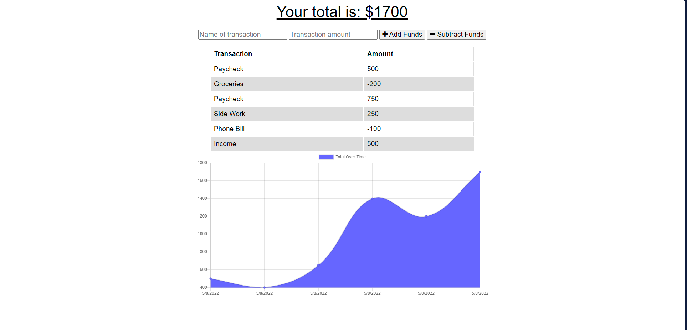

# Budget Tracker

## Description
This application will allow you to track your income and expenses on the go using indexDB to add when there is no internet connection. Once you are connected back to the internet the application will update the server. 

## Table of Contents

- [Installation](#installation)
- [Usage](#usage)
- [Credits](#credits)
- [License](#license)
- [Tests](#tests)
- [Questions](#questions)

## Installation
npm i

## Usage
Download or clone the repo to your machine, navigate to the command prompt and run npm i to install all the necessary packages. Once you are ready run npm start to run the application.  

## Walkthrough or Screenshot

## Credits
Jace Burgess, Bobbi Tarkani (tutor)

## License
A short and simple permissive license with conditions only requiring preservation of copyright and license notices. Licensed works, modifications, and larger works may be distributed under different terms and without source code.
[MIT](https://opensource.org/licenses/MIT)

## Tests
N/A

## Questions
- GitHub Account: Jburg1414
- Email Address: jburgess1414@gmail.com
